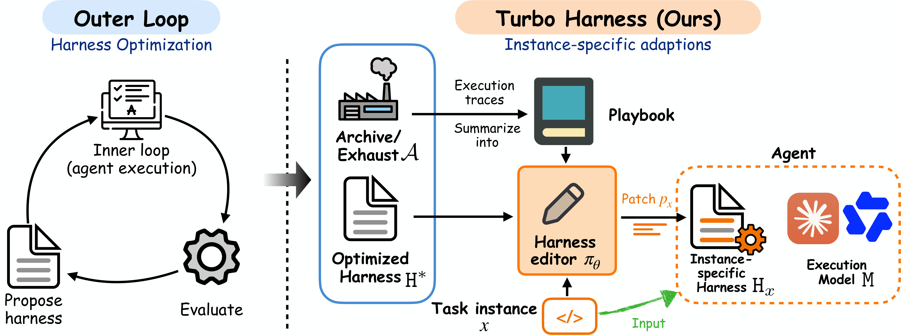

# Turbo Harness: Instance-Adaptive Harness Optimization

<p align="center">
  <a href="https://arxiv.org/abs/2609.40330"></a>
  <a href="LICENSE"></a>
  <a href="pyproject.toml"></a>
  
</p>

<p align="center">
  <b>Tunyu Zhang</b><sup>1,2,&ast;,&dagger;,&Dagger;</sup>&emsp;
  <b>Hao Wang</b><sup>2,3,&ast;</sup>&emsp;
  <b>Kai Xu</b><sup>2,3</sup>&emsp;
  <b>Dimitris N. Metaxas</b><sup>1,&Dagger;</sup>
</p>

<p align="center">
  <sup>1</sup>Rutgers University&emsp;<sup>2</sup>Red Hat AI Innovation&emsp;<sup>3</sup>MIT-IBM Watson AI Lab
</p>

<p align="center">
  <sub><sup>&ast;</sup>Equal contribution&emsp;<sup>&dagger;</sup>Work done during an internship at Red Hat AI Innovation&emsp;<sup>&Dagger;</sup>Correspondence: <a href="mailto:ty.zhang@rutgers.edu">ty.zhang@rutgers.edu</a>, <a href="mailto:dnm@cs.rutgers.edu">dnm@cs.rutgers.edu</a></sub>
</p>

Research code for **Turbo Harness**, a harness-optimization framework that adapts a
globally optimized agent harness to *each task instance* by **reusing the artifacts
produced during the global harness search**. It summarizes those artifacts into a
structured **playbook** and trains a small **harness editor** to emit an
instance-specific **patch** to the global harness `H*`; the tailored harness `H_x`
is what the frozen execution model then runs.



*An outer loop optimizes a global harness `H*`, producing trajectories/evaluations as
"exhaust"; Turbo Harness recycles that exhaust into a playbook and trains a small RL
editor `π_θ` that patches `H*` into a per-instance harness `H_x`, which the frozen model runs.*

## Overview

An agent is a frozen language model **M** running inside a **harness H** — the
executable scaffold that constructs context, calls tools, keeps state, and
controls the loop. Turbo Harness has three stages:

1. **Meta-Harness (Stage A)** — an outer-loop search produces a strong *global*
   harness `H*`, and as a byproduct a search archive of trajectories/evaluations.
2. **Playbook (Stage B)** — those byproducts are distilled into a
   compact **playbook** of harness-editing strategies and anti-patterns.
3. **Harness editor (Stage C)** — a small RL-trained (GRPO) **Qwen3.5-9B** editor
   reads each instance + the playbook and emits a **patch** to `H*`, yielding a
   per-instance harness `H_x` that the frozen model **M** then runs. One editor
   call per instance.

**Why it helps.** (i) *Flexibility* — a per-instance harness outperforms a single
global harness (e.g. SWE-smith-MR: 50.7 → 64.0 with Haiku, 70.7 → 88.0 with Gemini).
(ii) *Lightweight* — the editor only **patches** `H*` rather than writing a harness
from scratch, so a small model suffices (Qwen3.5-9B) and it is called once per
instance. (iii) *Low overhead* — the adapted harness often runs in **fewer steps**,
in several settings lowering total execution cost below the global harness.

## Results

| Benchmark | Executor | Metric | Default | Meta-Harness | **Turbo (ours)** |
|---|---|---|--:|--:|--:|
| SWE-smith-MR | Claude Haiku 4.5 | resolve % | 42.0 | 50.7 | **64.0** |
| SWE-smith-MR | Gemini 3.7 Flash | resolve % | 44.0 | 70.7 | **88.0** |
| SWE-bench Verified | Claude Haiku 4.5 | resolve % | 31.6 | 56.7 | **59.3** |
| SWE-bench Verified | Gemini 3.7 Flash | resolve % | 24.4 | 38.4 | **54.4** |
| ALFWorld | Qwen3.5-9B | success % | 40.7 | 60.7 | **70.7** |
| Terminal-Bench-2.1 | Claude Sonnet 4.5 | pass % | 52.3\* | 50.5 | **55.5** |

\*On TB2.1, "Default" is Terminus-Kira, the strongest human-designed harness
baseline. The coding benchmarks use a 40-step / \$3-per-issue budget; we report the
controlled Default → Meta → Turbo deltas at this fixed budget (see [`docs/REPRODUCE.md`](docs/REPRODUCE.md)).

Beyond accuracy, Turbo Harness is typically **more efficient** than the global
Meta-Harness — resolving issues in fewer steps and at lower cost in most settings
(e.g. on SWE-smith-MR with Gemini, ~8.7 steps/issue vs 23.1).

## Demo

A single **example run** on one SWE-smith issue (frozen Claude Haiku 4.5 student): the trained editor
reads the issue + playbook + the global harness `H*`, emits a per-instance patch, and the student solves
the bug under the patched harness — while the unoptimized Default harness does not. This is one real,
representative run; outcomes vary per instance/seed (Turbo resolves ~64% of SWE-smith issues vs 42% for
Default). Run it yourself with one command — `bash demo/run.sh` (see [`demo/README.md`](demo/README.md)).


## Repository layout

```
turbo-harness/
├── turbo_harness/        # method package (infra, playbook, rl, eval, per-domain code)
│   └── config.py         # central config: paths, project ids, model ids via env vars
├── SkyRL/                # vendored RL trainer (Stage C) — added with the rl module
├── scripts/              # one clean pipeline script per benchmark (evolve→playbook→rl→eval)
├── configs/              # GRPO hyper-parameters per benchmark
├── data/                 # committed train/val/test splits
├── artifacts/            # committed global harnesses H* + playbooks (stage-A/B inputs)
└── docs/
    ├── DEPENDENCIES.md   # environment setup (dev venv, SkyRL training venv, TB2 extra)
    └── REPRODUCE.md      # per-benchmark reproduction commands + budget caveats
```

## Installation

See [`docs/DEPENDENCIES.md`](docs/DEPENDENCIES.md). Copy `.env.example` to `.env`
and fill in your Vertex AI project / server URLs / storage roots.

## Reproducing results

See [`docs/REPRODUCE.md`](docs/REPRODUCE.md).

## Citation

```bibtex
@misc{zhang2026turboharness,
  title         = {Turbo Harness: Instance-Adaptive Harness Optimization},
  author        = {Zhang, Tunyu and Wang, Hao and Xu, Kai and Metaxas, Dimitris N.},
  year          = {2026},
  eprint        = {2609.40330},
  archivePrefix = {arXiv},
  primaryClass  = {cs.AI},
  url           = {https://arxiv.org/abs/2609.40330}
}
```

## License

MIT (see [`LICENSE`](LICENSE)). Vendored and third-party components retain their
own licenses; see [`NOTICE`](NOTICE).
